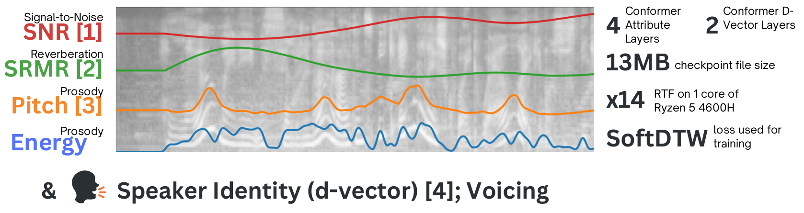

[](https://vocex-demo.streamlit.app)

# Vocex

## What does it do?
Vocex extracts several sequence level measures from audio using a small neural network. It also extracts d-vectors, which are a 256 dimensional representation of the speaker's voice. It can also be used to extract speaker avatars, which are a 2D representation of the speaker's voice (derived from the d-vector).



## Installation

```pip install vocex```

Vocex requires torch, which is not installed automatically, to not interfere with specific torch installations which not be recognized by pip.

## Usage

```python
from vocex import Vocex
import torchaudio # or any other audio loading library

model = vocex.from_checkpoint('vocex/cdminix') # an fp16 model is loaded by default
model = vocex.from_checkpoint('vocex/cdminix', fp16=False) # to load a fp32 model
model = vocex.from_checkpoint('some/path/model.ckpt') # to load local checkpoint

audio = ... # a numpy or torch array is required with shape [batch_size, length_in_samples] or just [length_in_samples]
sample_rate = ... # we need to specify a sample rate if the audio is not sampled at 22050

outputs = model(audio, sample_rate)
pitch, energy, snr, srmr = (
    outputs["measures"]["pitch"], 
    outputs["measures"]["energy"],
    outputs["measures"]["snr"],
    outputs["measures"]["srmr"],
)
d_vector = outputs["d_vector"] # a torch tensor with shape [batch_size, 256]

# you can also get activations and attention weights at all layers of the model
outputs = model(audio, sample_rate, return_activations=True, return_attention=True)
activations = outputs["activations"] # a list of torch tensors with shape [batch_size, layers, ...]
attention = outputs["attention"] # a list of torch tensors with shape [batch_size, layers, ...]

# there are also speaker avatars, which are a 2D representation of the speaker's voice
outputs = model(audio, sample_rate, return_avatar=True)
avatar = outputs["avatars"] # a torch tensor with shape [batch_size, 256, 256]
```

## How was it trained?

Vocex is essentially as student model trained on both algorithmic and learned speech methods which extract attributes from speech. They are:
- pitch using [pyworld](https://github.com/JeremyCCHsu/Python-Wrapper-for-World-Vocoder)
- energy using some simple heuristics
- snr using [wada snr](https://gist.github.com/johnmeade/d8d2c67b87cda95cd253f55c21387e75)
- srmr using [srmrpy](https://github.com/jfsantos/SRMRpy)
- dvectors using [ge2e](https://github.com/yistLin/dvector)

## Demo
There is also a demo available at [vocex.cdminix.me](https://vocex.cdminix.me)
